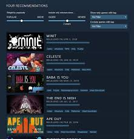

# SteaMine: Finding Hidden Gems in Steam's Long Tail


SteaMine studies a core discovery paradox in the Steam marketplace: **many games are liked, but only a small fraction are seen**.  
Using game metadata, engagement features, and large-scale review language, the project explains why similarly tagged games can end up with very different outcomes, helps surface hidden gems, and highlights **tag-vs-reality** mismatches between store labels and player experience.

## Start here

- Main deliverable: [**`main_notebook.ipynb`**](./main_notebook.ipynb)
- Checkpoint notebooks: [`checkpoints/checkpoint_1.ipynb`](./checkpoints/checkpoint_1.ipynb), [`checkpoints/checkpoint_2.ipynb`](./checkpoints/checkpoint_2.ipynb)
- Pitch video: https://youtu.be/_ceeB4O_iUM
- Environment: Google Colab, Python 3.11

---

## Table of contents

1. [What this project does](#what-this-project-does)  
2. [Motivation in one paragraph](#motivation-in-one-paragraph)  
3. [Key insights](#key-insights)  
4. [Repository layout](#repository-layout)  
5. [Dataset](#dataset)  
6. [Final notebook (`main_notebook`) at a glance](#final-notebook-main_notebook-at-a-glance)  
7. [Research questions → methods → outputs](#research-questions--methods--outputs)  
8. [Key quantitative results (documented run)](#key-quantitative-results-documented-run)  
9. [Algorithms and libraries](#algorithms-and-libraries)  
10. [Environment, installation, and reproduction](#environment-installation-and-reproduction)  
11. [Preprocessing summary](#preprocessing-summary)  
12. [Limitations and future work](#limitations-and-future-work)  
13. [Deliverables and links](#deliverables-and-links)  
14. [Citation](#citation)

---

## Why this matters

On the merged sample, recommendation quality and visibility diverge sharply: a game can be well-reviewed and still nearly invisible.  
SteaMine turns that gap into measurable outputs that can be inspected by players, developers, and marketplace stakeholders.

### Long-tail problem (core motivation)

The key question behind this project is: **if many games are liked, why do so few capture attention?**  
That is the long-tail visibility problem this notebook quantifies and explains.

> In our documented run, the top 10% of games capture 99.1% of peak-CCU visibility.


---

## Visual highlights

Below are supporting visuals for the discovery context and recommendation ecosystem that this analysis investigates.





For quantitative project outputs (long-tail histogram, segment map, and tag-vs-reality analysis plots), see `main_notebook.ipynb`.

---

## What this project does

SteaMine is a single end-to-end notebook narrative that:

- Loads **Steam game metadata** (`games.json`) and **per-game review CSVs** from the Mendeley dataset.  
- **Merges** them on `app_id` so every downstream analysis uses the **same game universe**.  
- Runs **three analysis blocks** (genre association mining, engagement clustering, review topics + sentiment).  
- Produces **three user-facing interpretations**: **Hidden Gems Finder**, **Tag vs. Reality Checker**, and **Market Position View** (with fixed segment colors across plots).

The main notebook is reproducible (`RANDOM_STATE = 42` where randomness applies) and documents concrete metrics from a full run.

---

## Motivation in one paragraph

A lot of Steam games are genuinely liked by players, but attention is not shared fairly.  
SteaMine focuses on that gap: it helps explain why good games stay hidden, surfaces hidden gems, and compares what store tags promise vs what players actually describe in reviews.

In the documented run, the median game-level recommendation rate is **0.8421**, but visibility is highly concentrated: the top **10%** of games account for **99.1%** of total peak-CCU visibility.

---

## Key insights

- Strong ratings alone do not guarantee visibility.
- Hidden gems can be identified systematically from high-recommendation, low-attention patterns.
- Tag-vs-reality gaps are observable in review language and sentiment.
- Combining rule mining, segmentation, and NLP gives a fuller explanation than any one metric alone.

---

## Repository layout

| Path | Role |
|------|------|
| **`main_notebook.ipynb`** | **Final curated narrative** — primary artifact this README describes. |
| `checkpoints/checkpoint_1.ipynb` | Checkpoint 1 — EDA, dataset choice, feasibility. |
| `checkpoints/checkpoint_2.ipynb` | Checkpoint 2 — research questions and method mapping. |
| `scripts/build_full_reviews_cache.py` | Preprocessing utility to build full review parquet cache from raw CSV files. |
| `requirements.txt` | Python dependencies for local or Colab-style runs. |
| `README.md` | This file. |

Final notebook lives at the repository root; checkpoint notebooks are in `checkpoints/`.

---

## Dataset

**Primary source:** *Steam Games Metadata and Player Reviews (2020–2024)*, **Mendeley Data**, DOI **[10.17632/jxy85cr3th.2](https://data.mendeley.com/datasets/jxy85cr3th/2)** (Abdelqader, 2025).

| Component | Contents |
|-----------|-----------|
| **`games.json`** | Per-game metadata: `app_id`, name, **genres**, price, playtime fields, **peak_ccu**, review counts, etc. On the order of **~65k** titles in the public metadata file. |
| **Review CSVs** | One file per game (typical naming: includes `app_id` in filename). Rows include **review text**, **recommend** flag, playtime at review, dates, helpfulness, etc. |

**Important:** numbers quoted in `main_notebook.ipynb` refer to that notebook's documented merge: after loading and cleaning, it documents **31,692,774** review rows and an inner merge leaving **23,107** games that appear in both loaded reviews and metadata. If you load more or fewer review files, counts change - always cite the run you executed.

A **Google Drive mirror** for the dataset is linked inside the notebook’s opening markdown (same link as in the deliverable index).

**Google Drive mirror (project data folder):** [steam_project drive folder](https://drive.google.com/drive/folders/1F5trj8KWjBqw4-Y8zJFdnCAFIJ2M8nVO?usp=share_link)

---

## Final notebook (`main_notebook`) at a glance

`main_notebook.ipynb` is structured roughly as follows:

1. **Data and reproducible setup** — paths (`GAMES_PATH`, `REVIEWS_GLOB`), load `games.json`, glob and concatenate review CSVs, clean types, parse genres, normalize `recommend`, build `analysis_df` (inner merge + per-game `rec_rate` / `review_count`).  
2. **Analysis A — Genre pattern signals (RQ1)** — genre baskets → **Apriori** and **FP-Growth** (mlxtend), rule tables and lift/confidence visuals.  
3. **Analysis B — Engagement segments (RQ2)** — scale features → **K-Means** with **k = 4**, silhouette sweep for k = 2…6, segment labels (**Hidden / Niche / Mid / Blockbuster-like**), segment-colored scatter plots.  
4. **Analysis C — Tag vs. reality (RQ3)** — English-oriented text filters, **LDA** (scikit-learn) on bag-of-words, **VADER** sentiment by recommend label and by segment; per-game / case-study style comparisons from an automatically selected same-rating, high-contrast pair.  
5. **System outputs** — **Hidden Gems Finder** (rule-based shortlist), **Tag vs. Reality** cards, **Market Position** figure with hidden-gem overlay.  
6. **Conclusion, limitations, future work** — consolidated bullets and roadmap.

The notebook may assume **Google Colab** for `drive.mount` and optional `pip` installs; see [Reproduction](#environment-installation-and-reproduction) for running locally.

---

## Research questions → methods → outputs

| RQ | Question (short) | Lens | Algorithms | Primary outputs |
|----|------------------|------|--------------|-----------------|
| **RQ1** | Which **genre combinations** associate with stronger **recommendation** context? | Store **presentation** | **Apriori**, **FP-Growth** (frequent itemsets / association rules) | Supports **Tag vs. Reality** (**tag / storefront** side) |
| **RQ2** | How do games split by **visibility** when ratings look similar? | **Attention / engagement** | **K-Means** (k = 4), **StandardScaler**, silhouette diagnostics | **Market Position View**, **Hidden Gems Finder** |
| **RQ3** | How does **review language** differ from **store labels**, especially for overlooked titles? | Player **experience** | **LDA**, **VADER**, **langdetect** (optional) | **Tag vs. Reality** (**“reality”** side from reviews) |

**Design choice (cluster count):** silhouette is **higher** for **k = 2**, but **k = 4** is kept for **interpretability** — four segments map to the product story (Hidden / Niche / Mid / Blockbuster-like) instead of collapsing to “high vs. low engagement” only.

---

## Key quantitative results (documented run)

Figures below match the documented run inside `main_notebook.ipynb` (your merge may differ if file coverage differs).

| Topic | Approximate value (from `main_notebook.ipynb`) |
|-------|-------------------------------|
| Games after inner merge | **23,107** |
| Review rows loaded & cleaned | **31,692,774** |
| Median game-level `rec_rate` | **0.8421** |
| Top 10% of games’ share of total peak CCU | **99.1%** (visibility concentration) |
| Spearman: `rec_rate` vs `peak_ccu` | **~+0.22** |
| Spearman: `rec_rate` vs `average_playtime_forever` | **~+0.08** |
| K-Means k | **4**; silhouette (this run) | **0.3907** |
| RQ1: Apriori vs FP-Growth | **Identical** frequent itemsets at `min_support = 0.10`; **58** rules with lift ≥ 1.0 |
| Strongest rule (example) | `{Indie, RPG} → {Adventure}` — **lift 1.395**, **confidence 0.622** |
| Hidden-gem thresholding note | `peak_ccu <= median` is **0** in this run, so shortlist emphasizes low/no observed CCU visibility |
| Hidden Gems shortlist (this run) | **3,421** candidates (transparent percentile rules in notebook) |

**LDA:** four topics are used as a **readable snapshot** (reactions/friction, product state, social positivity, design pillars — see notebook interpretation). **VADER:** recommended vs not-recommended distributions separate clearly in the documented plots; segment-level means are reported in the closing section.

---

## Algorithms and libraries

- **Core:** Python 3.11, **pandas**, **NumPy**, **SciPy**  
- **Plots:** **Matplotlib**, **Seaborn**  
- **Mining / ML:** **scikit-learn** (K-Means, scaling, `CountVectorizer`, `LatentDirichletAllocation`), **mlxtend** (Apriori / FP-Growth, `TransactionEncoder`)  
- **NLP:** **VADER** (`vaderSentiment`), **langdetect**, **NLTK** stopword lists where used  

See `requirements.txt` for minimum package versions.

---

## Environment, installation, and reproduction

### 1. Clone and install

```bash
git clone https://github.com/Nikithanatarajan1312/steam-steamine.git
cd steam-steamine
pip install -r requirements.txt
python --version
```

This project was developed using **Google Colab** and documented with **Python 3.11**.

For **Colab**, `pip install -r requirements.txt` is still the recommended starting point.
In a fresh notebook runtime, a package such as `vaderSentiment` may still need a manual install if the environment has been reset.

### 2. Obtain data

Download **`games.json`** and the **review CSV collection** from [Mendeley](https://data.mendeley.com/datasets/jxy85cr3th/2) (or use the Drive mirror linked in the notebook).

### 3. Configure paths

In **`main_notebook.ipynb`**, set:

- `GAMES_PATH` — path to `games.json`  
- `REVIEWS_GLOB` — glob that matches all review CSVs (e.g. `/path/to/reviews/*.csv`)
- `FULL_REVIEW_CACHE_PATH` — full parquet cache path if you built it with the preprocessing script

If `app_id` is missing inside a CSV, the notebook can recover it from the **filename** (see loading cell).

### 4. Run

- **Colab:** mount Drive if needed, then **Run all**.  
- **Jupyter:** skip or adapt the `drive.mount` cell; ensure the same packages are installed.

**Reproducibility:** `RANDOM_STATE = 42` is used for clustering, LDA, and random subsampling where applicable.

### 5. Full-dataset preprocessing script (recommended)

To support full-dataset runs without repeatedly re-reading thousands of CSV files, this repo includes:

- `scripts/build_full_reviews_cache.py`

Run it once to build a reusable parquet cache:

```bash
python "scripts/build_full_reviews_cache.py" \
  --reviews-glob "/absolute/path/to/Game Reviews/*.csv" \
  --output "/absolute/path/to/full_reviews_clean.parquet"
```

Then set `FULL_REVIEW_CACHE_PATH` in `main_notebook.ipynb` and keep `USE_REVIEW_CACHE = True`.

## Preprocessing summary

- **Metadata:** normalize columns, parse **genres** into sorted unique lists, coerce numeric fields, `dropna` / dedupe on `app_id`.  
- **Reviews:** lowercase column names, enforce required columns, normalize **`recommend`** to {0, 1}, drop rows missing `app_id` or `recommend`, strip review text.  
- **Cache build script:** `scripts/build_full_reviews_cache.py` consolidates raw review CSVs into `full_reviews_clean.parquet` for stable, faster notebook reruns.
- **Merge:** aggregate **`rec_rate`** and **`review_count`** per `app_id`, **inner-merge** onto `games` → **`analysis_df`**.  
- **RQ1:** each game’s genre list encoded as a **transaction** (`TransactionEncoder`) for itemset mining.  
- **RQ2:** features typically include **log-scaled** engagement fields plus price and `rec_rate`; **StandardScaler** before K-Means.  
- **RQ3:** length thresholds, optional English filter, **CountVectorizer** + **LDA**; **VADER** on review strings (truncated per scorer’s usual practice in code).

---

## Limitations and future work

Summarized from Section 8 of `main_notebook.ipynb` (not exhaustive):

- **Coverage:** results generalize to the **merged subset** (games with both metadata and loaded review files), not the entire Steam catalog.  
- **Association, not causation:** correlations and segments; not a causal identification of why a title is “Hidden.”  
- **LDA / lexicon:** topics are **qualitative**; some tokens can be noisy; VADER is **not** gaming-slang-tuned.  
- **Hidden Gems rules:** **transparent heuristics** (e.g. high `rec_rate` vs low `peak_ccu` by percentiles), not a learned ranker.  
- **Static snapshot:** not a time-series model of launch, updates, or seasonality.

**Future work** (from the same section) includes scaling to the full metadata catalog, stratified or transformer-based sentiment, temporal analysis on review dates, causal-style comparisons, recommender integration, and a small **Streamlit / Gradio** demo.

---

## Deliverables and links

| Item | URL |
|------|-----|
| **GitHub** | https://github.com/Nikithanatarajan1312/steam-steamine |
| **Pitch video (~2 min)** | https://youtu.be/_ceeB4O_iUM |
| **Dataset (Mendeley)** | https://data.mendeley.com/datasets/jxy85cr3th/2 |
| **Main notebook** | https://github.com/Nikithanatarajan1312/steam-steamine/blob/main/main_notebook.ipynb |
| **Checkpoint 1** | https://github.com/Nikithanatarajan1312/steam-steamine/blob/main/checkpoints/checkpoint_1.ipynb |
| **Checkpoint 2** | https://github.com/Nikithanatarajan1312/steam-steamine/blob/main/checkpoints/checkpoint_2.ipynb |
| **Preprocessing script** | https://github.com/Nikithanatarajan1312/steam-steamine/blob/main/scripts/build_full_reviews_cache.py |

---

## Citation

When referencing the dataset:

**Abdelqader, Hisham (2025).** *Steam Games Metadata and Player Reviews (2020–2024).* Mendeley Data, V2. DOI: **10.17632/jxy85cr3th.2**.  
https://data.mendeley.com/datasets/jxy85cr3th/2
